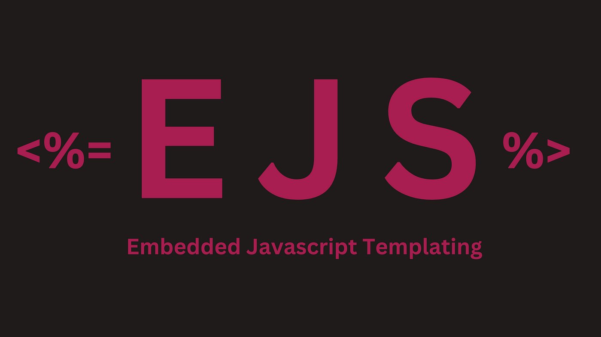

# Embedded JavaScript (EJS) for Dynamic Web Applications

This repository provides a detailed introduction and practical examples of using Embedded JavaScript (EJS), a templating engine for rendering dynamic HTML pages with JavaScript logic. EJS simplifies the creation of dynamic content by embedding JavaScript code within HTML templates, making it a popular choice for building server-side rendered applications in Node.js.

## What is EJS?

Embedded JavaScript (EJS) is a simple templating language that lets you generate HTML with plain JavaScript. It allows developers to embed JavaScript logic directly in their HTML files, rendering data dynamically on the server side. With EJS, you can easily loop over arrays, conditionally render content, and inject variables into your templates.

## Features

- **Simple Syntax**: EJS uses plain JavaScript to dynamically generate HTML content.
- **Server-Side Rendering**: Renders dynamic web pages on the server before sending them to the client.
- **Template Reuse**: Supports partials and template reuse to maintain consistency across your app.
- **Fast and Lightweight**: EJS is designed to be minimal and efficient for rendering views.
- **JavaScript Logic**: Includes native JavaScript syntax for loops, conditions, and more.

## EJS Syntax
EJS uses the following syntax to embed JavaScript into HTML:

<%= variable %>: Outputs the value of variable and escapes HTML characters.
<%- variable %>: Outputs the value of variable without escaping HTML characters.
<% code %>: Runs JavaScript code but does not output anything (used for logic like loops and conditions).

## Output Escaped Value (<%= %>): 
Outputs a value and escapes HTML characters to prevent XSS attacks.

## Output Unescaped Value (<%- %>): 
Outputs a value without escaping HTML characters, allowing raw HTML to be rendered.

## Control Flow Statements (<% %>): 
Executes JavaScript logic (like loops and conditionals) without rendering any output.

## Include a File (<%- include() %>): 
Embeds another EJS template within the current template, allowing for reusable components.

## Comments (<%# %>): 
Adds comments in the template that are not rendered in the output.

## For Loop (<% for (let i = 0; i < n; i++) { %>): 
Executes a block of code a specified number of times.

## If Statement (<% if (condition) { %>): 
Executes a block of code if the specified condition is true.

